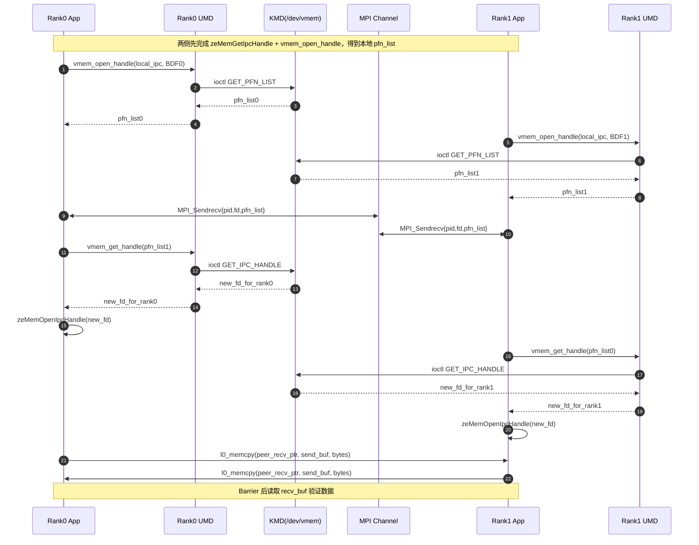

# vmem_tests 端到端时序图

```mermaid
sequenceDiagram
  autonumber
  participant R0 as Rank0 App
  participant U0 as Rank0 UMD
  participant K0 as KMD(/dev/vmem)
  participant MPI as MPI Channel
  participant R1 as Rank1 App
  participant U1 as Rank1 UMD

  Note over R0,R1: 两侧先完成 zeMemGetIpcHandle + vmem_open_handle，得到本地 pfn_list
  R0->>U0: vmem_open_handle(local_ipc, BDF0)
  U0->>K0: ioctl GET_PFN_LIST
  K0-->>U0: pfn_list0
  U0-->>R0: pfn_list0

  R1->>U1: vmem_open_handle(local_ipc, BDF1)
  U1->>K0: ioctl GET_PFN_LIST
  K0-->>U1: pfn_list1
  U1-->>R1: pfn_list1

  R0<<->>MPI: MPI_Sendrecv{pid,fd,pfn_list}
  R1<<->>MPI: MPI_Sendrecv{pid,fd,pfn_list}

  R0->>U0: vmem_get_handle(pfn_list1)
  U0->>K0: ioctl GET_IPC_HANDLE
  K0-->>U0: new_fd_for_rank0
  U0-->>R0: new_fd_for_rank0
  R0->>R0: zeMemOpenIpcHandle(new_fd)

  R1->>U1: vmem_get_handle(pfn_list0)
  U1->>K0: ioctl GET_IPC_HANDLE
  K0-->>U1: new_fd_for_rank1
  U1-->>R1: new_fd_for_rank1
  R1->>R1: zeMemOpenIpcHandle(new_fd)

  R0->>R1: l0_memcpy(peer_recv_ptr, send_buf, bytes)
  R1->>R0: l0_memcpy(peer_recv_ptr, send_buf, bytes)
  Note over R0,R1: Barrier 后读取 recv_buf 验证数据
```
